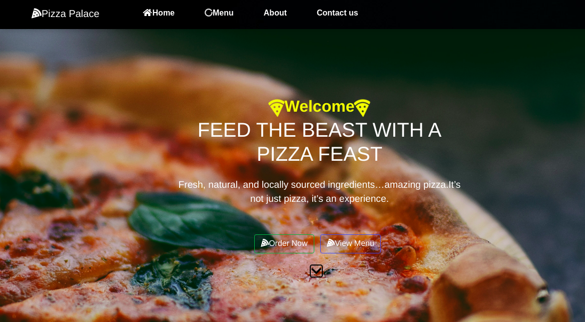

# {PIZZA WEB APP}
#### By **{Stephen Nderitu}**
## Description
This a web app for pizza which allows users or customers to select different pizza size,toppings and crust and order them.They can have them delivered or pick them up from the location of the pizza joint.
* You do this when you get to the order section of the page.
* Fill in the form with the order of your choice.
* You can also Add order before checkout.
* Press the check out button
* You can choose either to have it delivered or picked up.

## Setup/Installation Requirements
* git clone the live link
* Open up your vs code and live serve it
* Order your pizza

## Technologies Used
Bootstrap
Javascript
HTML5
Jquery
CSS
## Support and contact details
For any queries,compliments or suggestions reach me on Stevenderitu99@gmail.com
### License
MIT License

Copyright (c) [2020] [Stephen Nderitu]

Permission is hereby granted, free of charge, to any person obtaining a copy
of this software and associated documentation files (the "Software"), to deal
in the Software without restriction, including without limitation the rights
to use, copy, modify, merge, publish, distribute, sublicense, and/or sell
copies of the Software, and to permit persons to whom the Software is
furnished to do so, subject to the following conditions:

The above copyright notice and this permission notice shall be included in all
copies or substantial portions of the Software.

THE SOFTWARE IS PROVIDED "AS IS", WITHOUT WARRANTY OF ANY KIND, EXPRESS OR
IMPLIED, INCLUDING BUT NOT LIMITED TO THE WARRANTIES OF MERCHANTABILITY,
FITNESS FOR A PARTICULAR PURPOSE AND NONINFRINGEMENT. IN NO EVENT SHALL THE
AUTHORS OR COPYRIGHT HOLDERS BE LIABLE FOR ANY CLAIM, DAMAGES OR OTHER
LIABILITY, WHETHER IN AN ACTION OF CONTRACT, TORT OR OTHERWISE, ARISING FROM,
OUT OF OR IN CONNECTION WITH THE SOFTWARE OR THE USE OR OTHER DEALINGS IN THE
SOFTWARE.
Copyright (c) {year} **{Stephen Nderitu}**
